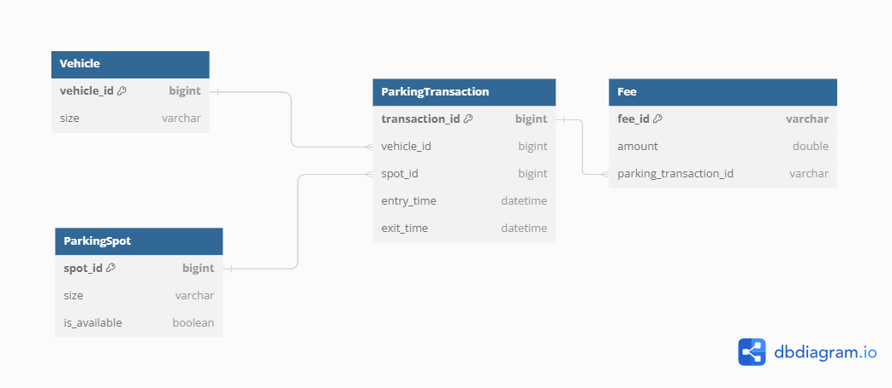
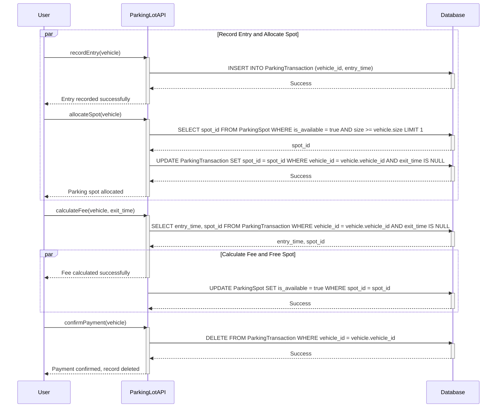
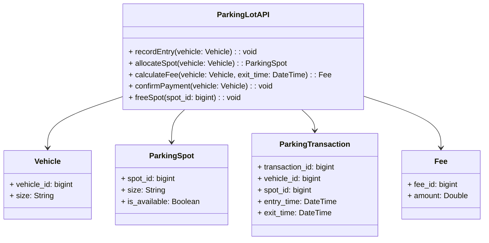

# Smart Parking Lot - Low Level Design
This is a Low-Level Design (LLD) document where detailed system components and their interactions are specified for the smart parking lot backend system. This system should handle vehicle entry and exit management, parking space allocation, and fee calculation.

## Document Information

| **Status** | **Owner**     | **Authors**   | **Version** | **Reviewed By** | **Approved By** |
|------------|---------------|---------------|-------------|-----------------|-----------------|
| 1          | Shikha Shetty | Shikha Shetty | 1           |                 |                 | 


## API Information

 **Name**                | **Version** | **Contract**  |
|------------------------|-------------|---------------|
| smart-parking-lot-api  | 1.0.0       | [RAML Contract](./api.raml) |

## Scope

### In Scope

1. Automatic parking spot allocation based on vehicle size.
2. Check-in and check-out time recording for vehicles.
3. Parking fee calculation based on duration and vehicle type.
4. Real-time update of parking spot availability.

### Out of Scope

1. User interface design and development.
2. Physical infrastructure and hardware details.
3. Integration with third-party payment gateways.

## Assumptions and Constraints

1. The parking lot has a reliable internet connection.
2. Vehicles and Parking spots are identified by unique IDs.
3. Parking spots have different sizes and availability status.
4. The system should handle multiple vehicles entering or exiting simultaneously

## Terms and Abbreviations

| **Term**        | **Description**                                 |
|-----------------|-------------------------------------------------|
| **API**         | Application Programming Interface               |
| **RAML**        | RESTful API Modeling Language                   |

## Implementation Design

### Business Logic

1. **Vehicle Entry:**
   - The user sends a request to recordEntry(vehicle).
   - The system inserts a new record into the ParkingTransaction table with the vehicle ID and entry time.
   - Simultaneously, the system allocates a parking spot to the vehicle by checking available spots that match the vehicle's size using allocateSpot(vehicle).
   - The system updates the ParkingTransaction table with the allocated spot ID.

2. **Calculate Fee and Exit:**
   - The user sends a request to calculateFee(vehicle, exit_time).
   - The system fetches the entry time and spot ID from the ParkingTransaction table.
   - The system calculates the fee based on the entry time and vehicle type and returns a success message to the user.
   - In parallel, the system frees up the parking spot by setting its availability to true in the ParkingSpot table.
    
3. **Confirm Payment:**
   - The user confirms payment through confirmPayment().
   - The system deletes the ParkingTransaction record for the vehicle, ensuring data integrity and freeing up space.

### ER Diagram 




### Sequence Diagram




### Class Diagram



### Endpoint Details

#### Record Entry

- **Endpoint:** `/recordEntry`
- **Method:** POST
- **Request:**
    ```json
    {
        "vehicleId": "string",
        "vehicleSize": "string"
    }
    ```
- **Response:**
    - **200 OK:**
        ```json
        {
            "message": "Entry recorded successfully"
        }
        ```
    - **400 Bad Request:**
        ```json
        {
            "errorCode": "ERR_400",
            "errorMessage": "Invalid vehicle details"
        }
        ```

#### Allocate Parking Spot

- **Endpoint:** `/allocateSpot`
- **Method:** POST
- **Request:**
    ```json
    {
        "vehicleId": "string",
        "vehicleSize": "string"
    }
    ```
- **Response:**
    - **200 OK:**
        ```json
        {
            "spotId": "string",
            "message": "Spot allocated successfully"
        }
        ```
    - **400 Bad Request:**
        ```json
        {
            "errorCode": "ERR_400",
            "errorMessage": "Invalid vehicle details"
        }
        ```
    - **404 Not Found:**
        ```json
        {
            "errorCode": "ERR_404",
            "errorMessage": "No available spots"
        }
        ```

#### Calculate Fee

- **Endpoint:** `/calculateFee`
- **Method:** POST
- **Request:**
    ```json
    {
        "vehicleId": "string",
        "exitTime": "datetime"
    }
    ```
- **Response:**
    - **200 OK:**
        ```json
        {
            "entryTime": "datetime",
            "spotId": "string",
            "message": "Fee calculated successfully"
        }
        ```
    - **400 Bad Request:**
        ```json
        {
            "errorCode": "ERR_400",
            "errorMessage": "Invalid vehicle details or exit time"
        }
        ```

#### Confirm Payment

- **Endpoint:** `/confirmPayment`
- **Method:** POST
- **Request:**
    ```json
    {
        "vehicleId": "string"
    }
    ```
- **Response:**
    - **200 OK:**
        ```json
        {
            "message": "Payment confirmed, record deleted"
        }
        ```
    - **400 Bad Request:**
        ```json
        {
            "errorCode": "ERR_400",
            "errorMessage": "Payment failed or invalid vehicle ID"
        }
        ```

#### Free Spot

- **Endpoint:** `/freeSpot`
- **Method:** POST
- **Request:**
    ```json
    {
        "spotId": "string"
    }
    ```
- **Response:**
    - **200 OK:**
        ```json
        {
            "message": "Spot freed"
        }
        ```
    - **400 Bad Request:**
        ```json
        {
            "errorCode": "ERR_400",
            "errorMessage": "Invalid spot ID"
        }
        ```


## Key Technical Discussion

| **ID** | **Raised On** | **Raised By** | **Description**                                                   | **Option**                | **Priority** | **Status**   | **Decision and Rational**                             | **Agreed By** | **Agreed On** |
|--------|---------------|---------------|-------------------------------------------------------------------|---------------------------|--------------|--------------|-------------------------------------------------------|---------------|---------------|


